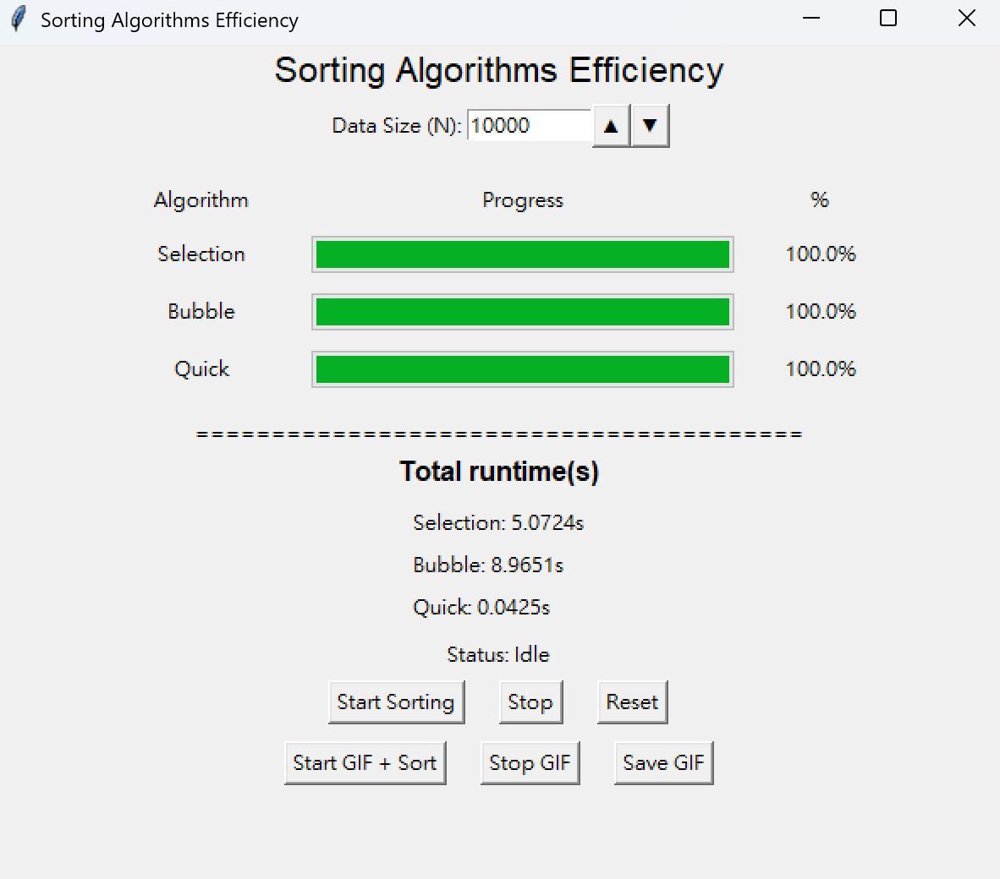
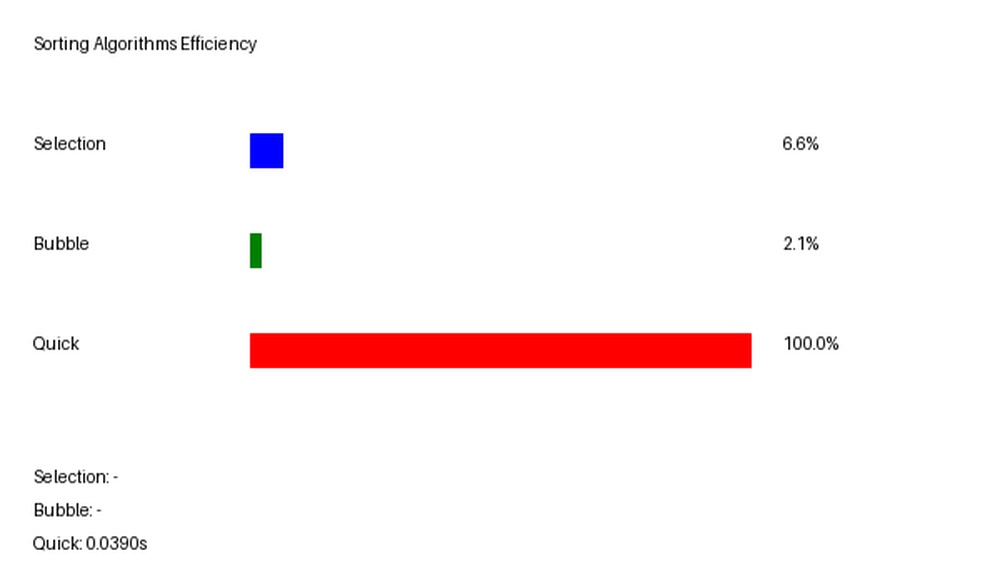

# hw3_algorithm_sorting

本作業為一個**排序演算法視覺化與效能比較系統**，透過 GUI 介面即時展示不同排序演算法的執行過程，並比較其執行效率

---

## 專案特色

- 支援下列三種排序演算法
  - Selection Sort（選擇排序）
  - Bubble Sort（泡沫排序）
  - Quick Sort（快速排序）
- 即時視覺化排序過程
- GUI 介面統一控制與顯示
- 執行進度條顯示各演算法進度
- 執行時間比較（秒為單位）
- 可自訂資料大小（N）

---

##  GUI 介面展示

### 主介面畫面

<p align="center">
  
</p>

---

##  執行動畫展示

<p align="center">
  
</p>

---

##  功能說明

###  1.排序演算法比較
系統會同時執行多種排序方法，並顯示：

- 各自進度條
- 完成百分比
- 執行時間

---

###  2.資料大小調整
使用者可以透過 GUI 調整輸入資料量（N），例如：

- N = 1,000
- N = 10,000
- N = 50,000（視系統效能而定）

---

###  3.即時視覺化
排序過程會以圖形方式呈現，方便觀察不同演算法的運作方式與效率差異。

---

###  4.儲存gif圖
按下 start gif+sorting 會開始錄下演算法在排序的進度條，再按下```stop gif```就會停止錄影，最後儲存```save gif```並設定```loop=0```，讓他能一直播放重複看進度跑條的速度。

---

###  5.流程順序

1. def 演算法
2. 抽取隨機陣列， print 出來排序確認是否正確
3. 使用 thread 並 print 出來最後各演算法使用的時間
4. 製作與調整 GUI 介面與進度條
5. 增加 stop 與 reset 功能
6. 增加儲存 gif 功能

---
## 中間遇到的困難

### 1. thread
在製作 GUI 介面時會發現， GUI 介面的進度條與會與處理演算法的 thread 互相搶，造成要有個設定 refresh GUI 的時間，否則會大幅增加演算法自己的 runtime ，但其實大部分不是演算法的時間複雜度造成的結果。

### 2. 進度跑條卡頓
由於 GUI 會搶 thread 變得需要強行分開演算法以及 GUI 這幾個執行的內容，從很卡的進度條變成稍微順一點的跑條。

### 3. 儲存gif圖
使用類似重新畫一個gif圖，取代原本用類似於螢幕截圖的方法，可以避免視窗位置都不同，同時也發現當使用螢幕截圖的方式，整體畫面會變得非常小，才採取這種方式。
